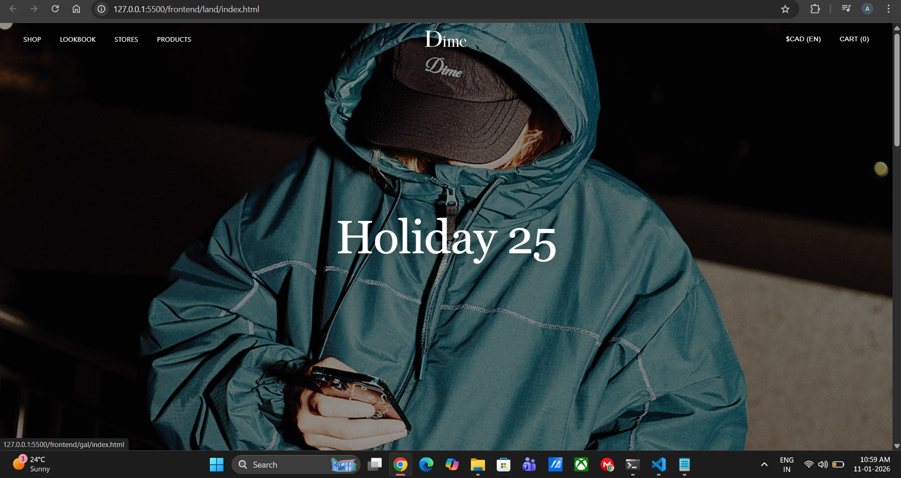
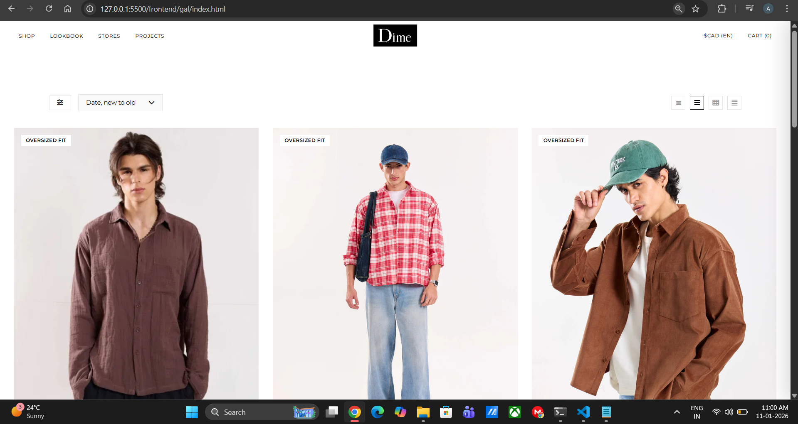
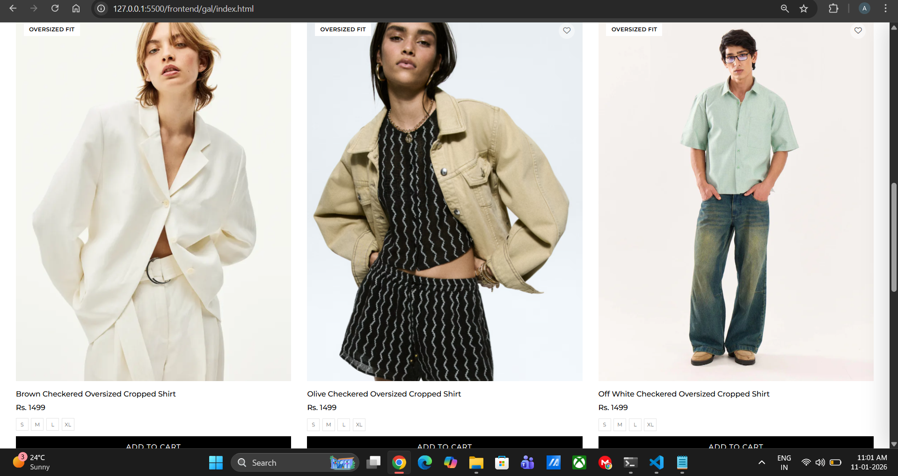
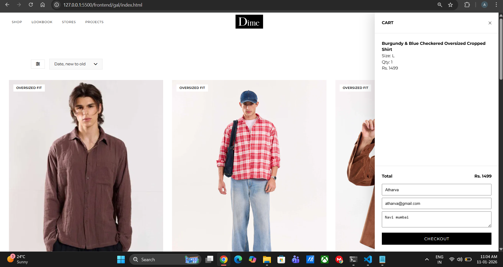
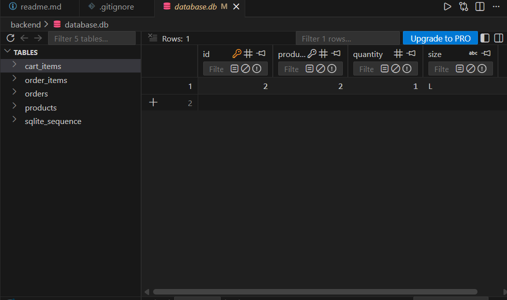
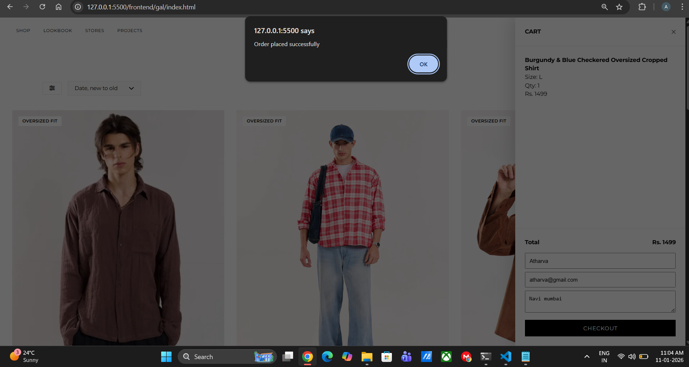
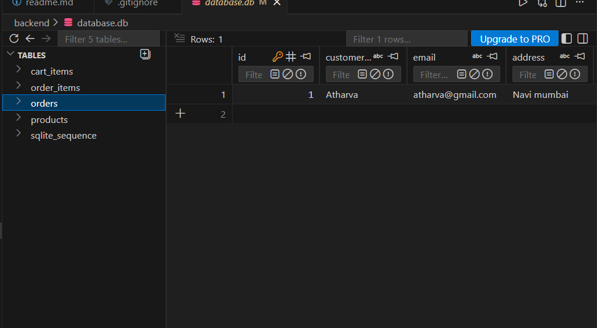

## 🛍️ Clothing Store – Full-Stack Development Project

This project is a **full-stack clothing e-commerce application** built using **HTML, CSS, JavaScript, Node.js, Express, and SQLite** during the development phase.

The focus of this project is **real-world application development**, not just UI — including backend APIs, database design, cart logic, orders, and debugging real issues that arise when frontend and backend interact.

---

## 🚀 Project Overview

The application simulates a **real clothing brand website** where users can:

* Browse products
* Select product sizes
* Add items to a cart
* View cart contents
* Checkout and place orders
* Persist data in a database

The UI is intentionally designed to look like a **modern fashion brand website**, while the backend handles all real logic and persistence.

---

## 🧱 Tech Stack (Development Phase)

### Frontend

* HTML
* CSS
* Vanilla JavaScript (no frameworks)
* Fetch API for backend communication

### Backend

* Node.js
* Express.js
* REST APIs

### Database

* SQLite (development database)
* SQL schema with relational tables

---

## 📂 High-Level Folder Structure (Development)

```
backend/
├── controllers/
│   ├── productController.js
│   ├── cartController.js
│   └── orderController.js
├── routes/
│   ├── productRoutes.js
│   ├── cartRoutes.js
│   └── orderRoutes.js
├── config/
│   └── database.js
├── models/
│   └── schema.sql
├── utils/
│   └── seedData.js
├── server.js
└── package.json

frontend/
├── landing/
│   ├── index.html
│   ├── style.css
│   └── script.js
├── gallery/
│   ├── index.html
│   ├── style.css
│   ├── product.js
│   └── cart.js
└── assets/
```

---
## Screenshots

### Homepage


### Product Gallery



### Adding items to cart




### Order confirmed




## 🧠 How the Application Works

### 1️⃣ Products

* Products are stored in the database
* Backend exposes `/api/products`
* Frontend fetches products dynamically and renders cards
* Images are mapped on the frontend to keep UI unchanged

---

### 2️⃣ Size Selection Logic

* User **must select a size** before adding a product to cart
* Selected size is tracked in frontend state
* Backend stores size per cart item
* Same product with different sizes is treated as a separate cart entry

---

### 3️⃣ Cart System

* Cart is **fully backend-driven**
* Cart items stored in `cart_items` table
* API endpoints:

  * `GET /api/cart`
  * `POST /api/cart/add`
* Quantity automatically increments if the same product + size is added again

---

### 4️⃣ Cart Drawer (UI)

* Cart opens as a side drawer
* Drawer fetches latest cart data from backend every time it opens
* UI updates immediately after add-to-cart without page reload

---

### 5️⃣ Checkout & Orders

* User enters name, email, and address
* On checkout:

  * Order is saved to `orders` table
  * Order items saved to `order_items`
  * Cart is cleared after successful order
* Full order lifecycle handled on backend

---

## 🐛 Real Issues Faced & How They Were Solved

This project intentionally documents **real problems developers face**, not just ideal scenarios.

### ❗ Issue 1: “Data not reflecting in SQLite instantly”

**Cause**

* SQLite DB Browser does not auto-refresh when Node.js writes to the DB.

**Learning**

* The database **was updating instantly**
* The tool (DB Browser) was showing cached data

**Solution**

* Use API responses or SQLite CLI for verification
* Understand tooling limitations vs actual bugs

---

### ❗ Issue 2: Cart data appearing only after reload

**Cause**

* UI was not re-fetching data after backend mutations

**Learning**

* Backend-driven apps require **explicit UI refresh**
* Frontend state ≠ database state

**Solution**

* Expose `loadCart()` globally
* Re-fetch cart immediately after add-to-cart

---

### ❗ Issue 3: “Nothing is inserting, no errors”

**Cause**

* SQLite schema changed but database file was not recreated

**Learning**

* SQLite does **not auto-migrate schemas**
* Silent failures can happen without proper logging

**Solution**

* Recreate DB after schema changes
* Add backend logging during debugging

---

### ❗ Issue 4: Duplicate variable / script loading errors

**Cause**

* Same JS file loaded multiple times
* Globals declared twice

**Learning**

* Script order and scope matter in vanilla JS
* Global namespace must be handled carefully

**Solution**

* Clean script loading
* Avoid redeclaring constants

---

## 📘 What We Learned From This Project

This project taught **far more than just coding UI**:

* How frontend and backend really interact
* How databases behave in real environments
* How silent failures happen and how to debug them
* Why backend-driven state is different from frontend-only apps
* How real e-commerce cart logic works
* Why tooling behavior matters as much as code
* How to debug step-by-step instead of guessing

Most importantly:

> **Not every “bug” is a code bug — sometimes it’s a tooling or architecture misunderstanding.**

---

## ✅ Current Development Status

* ✔ Fully functional cart
* ✔ Size-based product handling
* ✔ Persistent database storage
* ✔ Order placement flow
* ✔ UI preserved exactly as designed
* ✔ Backend APIs stable

---

## 🧠 Final Note

This project represents a **realistic full-stack development journey**, including mistakes, debugging, refactoring, and learning.

It is intentionally built without frameworks on the frontend to deeply understand:

* DOM
* Fetch
* State
* Event flow
* API communication
-------
## ▶️ How to Run This Project (Development)

Follow these steps to run the project **locally in development mode**.

---

### 🔹 Prerequisites

Make sure you have:

* **Node.js** (v16 or above)
* **npm**
* **SQLite** (CLI optional, DB Browser optional)
* Any modern browser (Chrome recommended)

---

### 🔹 Step 1: Clone the Repository

```bash
git clone <your-repo-url>
cd <repo-name>
```

---

### 🔹 Step 2: Setup Backend

```bash
cd backend
npm install
```

---

### 🔹 Step 3: Create Database & Seed Data

This creates the SQLite database and inserts sample products.

```bash
node utils/seedData.js
```

This will:

* Create `database.db`
* Create all required tables
* Insert sample product data

> ⚠️ Note:
> If you change `schema.sql`, you must delete `database.db` and re-run this step.

---

### 🔹 Step 4: Start Backend Server

```bash
node server.js
```

Backend will start on:

```
http://localhost:5000
```

Health check:

```
http://localhost:5000/api/health
```

---

### 🔹 Step 5: Run Frontend

Since the frontend is **pure HTML/CSS/JS**, you can:

#### Option A (Recommended)

Use **VS Code Live Server**

* Open `frontend/landing/index.html`
* Click **“Go Live”**

#### Option B

Open the HTML files directly in the browser.

---

### 🔹 Step 6: Use the Application

1. Open **Landing Page**
2. Navigate to **Products / Gallery**
3. Select product size
4. Click **Add to Cart**
5. Open cart drawer
6. Checkout and place order

---

### 🔹 Step 7: Verify Database (Optional)

Using SQLite CLI:

```bash
sqlite3 database.db
```

```sql
SELECT * FROM cart_items;
SELECT * FROM orders;
SELECT * FROM order_items;
```

> ⚠️ Note:
> SQLite DB Browser does not auto-refresh external writes.
> Reload the DB or reopen the file to see new data.

---


#### Same Project with Azure infra will be published soon......
